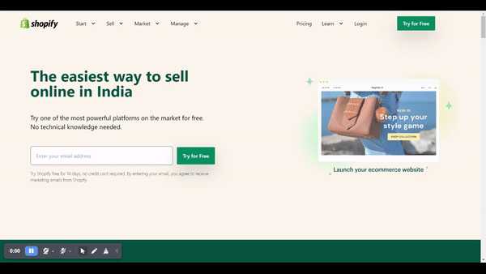
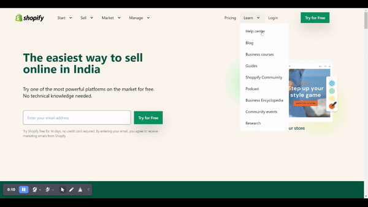
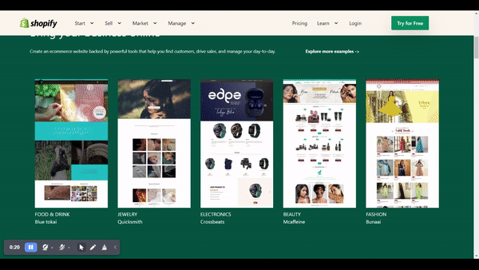
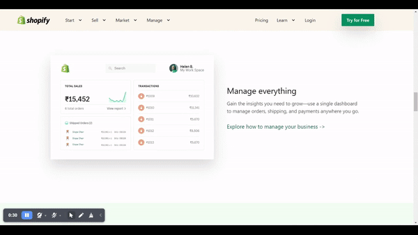
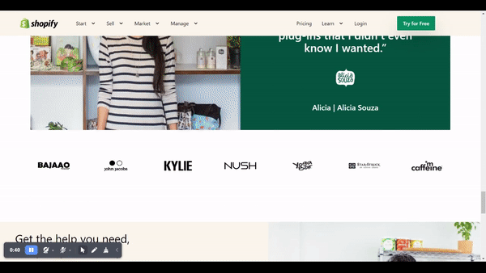

# Shopify clone using Tailwind-CSS

---

- This project is a part of the Full Stack Javascript Web   Developer Bootcamp by iNeuron.
- This is a Clone of a popular E-Commerce Website Builder tool Shopify.in.
- The easiest way to sell online in India
- Try one of the most powerful platforms on the market for free. No technical knowledge needed.
- Technologies used to design the webpage

  

  

  
MOBILE RESPONSIVE

- Well `Tailwind-CSS` is the first `CSS Framework` I have ever learnt.

## Learnings

- After making the first project in `Tailwind-CSS`. I was confident on acomplishing the same for this project.
- After wrapping my head around the `navbar` I finally figured out the solution and finished building it 
- I also tackled several issues but overcame all of them and finished the project
- I made the webpage over five day's time and learned a lot about the popular framework `Tailwind-CSS`
- The webpage itself was pretty lenghty and took me almost **14-16 Hours** to complete over four to five days

## Preview

## Made By Shivam Singh Shandilya
